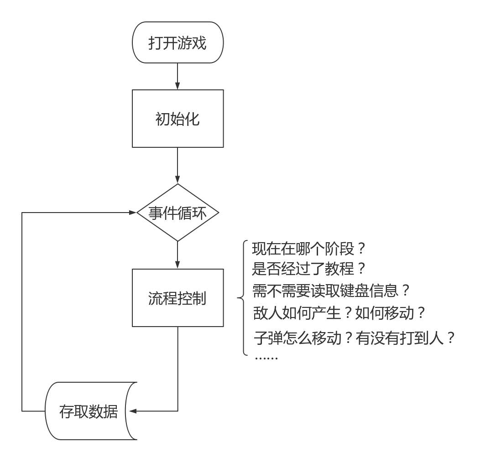
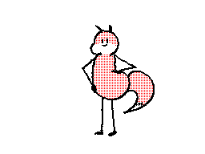
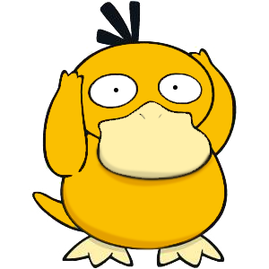
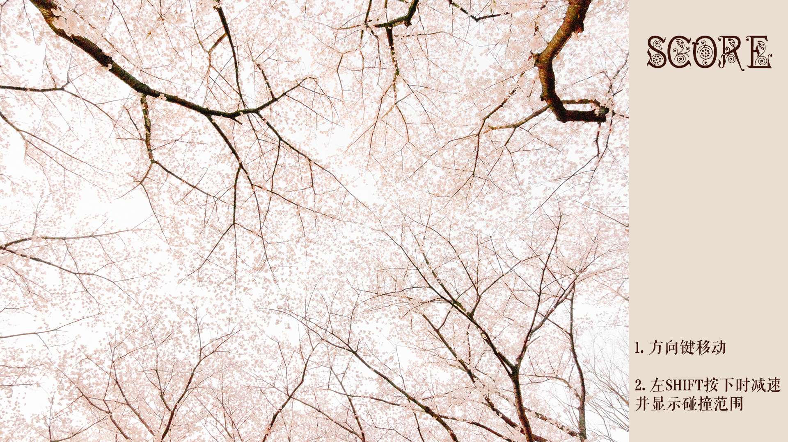
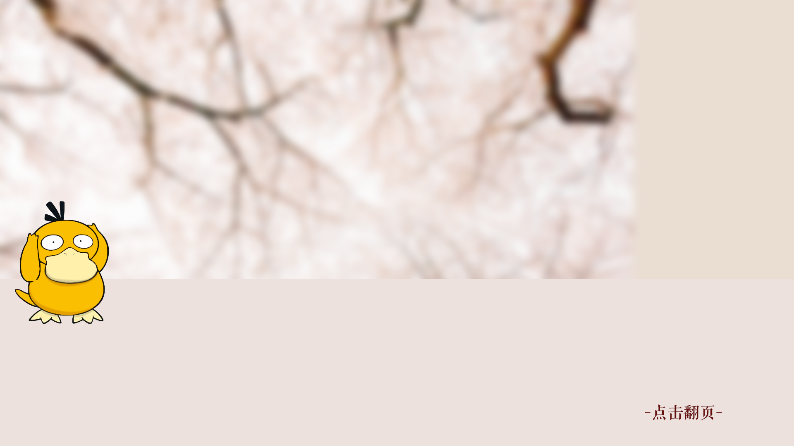
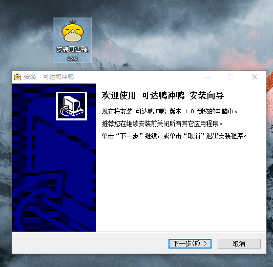

# 实验报告——基于pygame的弹幕游戏
    2019-05-26 16:42:18
    数学与科学学院 姚添译
<br>

## 前言

之所以想到做一个弹幕游戏，主要是出于自己对东方弹幕游戏系列的喜爱，其次也是因为实在不太清楚有什么合适的python项目可以拿来练手。在选题期间我也尝试做了其他的项目，但做到一半就遇到问题，于是转战这个项目。
这个项目主要是利用python的`pygame`库编写，初步实现了弹幕游戏应该具有的功能——开始界面、选关界面、剧情对话、敌人和子弹的生成、角色的移动闪避、胜负判断等。
<br>
<br>

## 实现过程

<br>

### 整体构思

从零开始一向是很难的，在看了许多pygame相关教程和恶补无数语法之后，我还是决定走一步看一步……

### 流程控制


总体结构很简单，但是要考虑的细节非常之多。
在具体实现的代码中，我定义了一个全局变量`game_state`，放在common.py中，用来控制游戏进程：
* 1 - 开始界面
* 2 - Spring关卡
* 3，4，5 - 没有来得及做完，预留关卡
* 6 - 胜利界面
* 7 - 失败界面
在Spring关卡部分又用全局`spring_chapter`作为进程指示：
* 1 - 第1部分
* 2 - 第2部分
* 3 - 第3部分
事实上游戏流程部分到此就结束了，因为时间太短，我只做了第一个关卡的前三节。不过大楼框架已经搭完，加入关卡只是装修……

### 实体生成

妄想采用OOP的我创建了继承自`pygame.sprite.Sprite`的Enemy类、Me类和bullet类分别用来保存敌人、自己和子弹。

Sprite（精灵）类自身有update方法，只要包含Sprite的Group(`pygame.sprite.Group` 精灵组)调用自身的update方法，所有存在于该组中的精灵都会调用自身的update方法。因此只要在update时重新绘制自身便可实现动画效果。

不同的实体有不同的行为逻辑：
1.  自身的行为逻辑是单一的，只需要响应用户的操作；
1.  不同类别敌人的逻辑各不相同，但是并不想过多建立子类，于是创建了自身的`ai`属性加以区分：
    * self.ai == 1 -> 杂兵   左右横跳并发射自机狙
    * self.ai == 2 -> BOSS   左右横跳并发射散射弹
    * ……
1.  子弹的处理也是如此：
    * self.ai == 1 -> 自机狙 自动瞄准发射时玩家的位置
    * self.ai == 2 -> 散射弹 产生一圈弹幕并逐渐旋转扩大
    * self.ai == 3 -> 随缘弹 在顶部随缘产生的弹幕
    * ……

### 实体绘制

* 主角夭折版：(绘制要求太高)

    
* 主角初版：

    
    
    ~~不知道为什么感觉有点奇怪~~
    <br>
* 第二版：
    去掉了花里胡哨的黄瓜，只保留了精髓。
    
    
    同时绘制了减速时显示碰撞箱的主角：
    
    <br>
* 最终版
    给游戏加了一个背景故事，不再这么无厘头，所以主角换成了可达鸭：
    
    <br>
* 尝试过的各种不同的子弹(第一个是白的，看不见)
    
    
    
    
    

### UI绘制

* 开始界面
    
    <br>
* 图片背景
    
    <br>
* 对话背景
    这一部分采用整个图片渲染而不是覆盖矩形框，主要是为提升效率。
    

### 代码细节
    为防止疲劳，只放一点点代码
```python
def state_tutorial():
    """教程部分"""

    global tutorial_indicator
    global grey_rect
    global spring

    screen.blit(spring, (0, 0))
    spring.blit(grey_rect, (0, 0))
    draw_tutorial(tutorial_text[tutorial_indicator])
    pygame.display.flip()

    """检测鼠标点击"""
    for event in event_list:

        if event.type == MOUSEBUTTONDOWN:
            grey_rect = pygame.image.load("interface/grey_rect.png").convert_alpha()
            spring.blit(grey_rect, (0, 0))
            tutorial_indicator += 1
            try:
                draw_tutorial(tutorial_text[tutorial_indicator])
            except IndexError:
                spring = pygame.image.load("interface/spring1.png").convert_alpha()
                common.tutorial = True
                circle_spawn(me.rect[0], me.rect[1] - height * 0.5556, 300, 10, 2.5, group_enemy)
                common.spring_chapter = 1
            pygame.display.flip()

    """检测ESC"""
    if common.key_list[K_ESCAPE]:
        sys.exit()
```
```python
def stage_2_insensitive():
    global track
    global group_enemy
    global group_bullet

    if common.spring_chapter == 1:

        if len(group_enemy) == 0:
            """换音乐"""
            pygame.mixer.music.stop()
            track = pygame.mixer.music.load('sound/鸡你太美.mp3')
            pygame.mixer.music.play()

            """从Ch1跳转到Ch2"""
            cxk_spawn(width * 0.10, height * 0.2, group_enemy)
            cxk_spawn(width * 0.62, height * 0.2, group_enemy)
            cxk_spawn(width * 0.10, height * 0.8, group_enemy)
            cxk_spawn(width * 0.62, height * 0.8, group_enemy)
            common.time_dict["Spring_Ch2_start"] = common.get_time()
            common.spring_chapter = 2
            for i in group_me:
                random_spawn(i.rect[0], i.rect[1], 20, group_enemy=group_enemy, speed=3)

    elif common.spring_chapter == 2:

        common.time_dict["Spring_Ch2"] = common.get_time() - common.time_dict["Spring_Ch2_start"]
        draw_time(common.time_dict["Spring_Ch2"])

        if len(group_enemy) == 0 or common.time_dict["Spring_Ch2"] > 40000:
            group_enemy = pygame.sprite.Group()
            group_bullet = pygame.sprite.Group()

            """跳转至Ch3"""
            common.time_dict["Spring_Ch3_start"] = common.get_time()
            common.spring_chapter = 3

            """播放音乐"""
            pygame.mixer.music.stop()
            pygame.mixer.music.set_volume(1.0)
            track = pygame.mixer.music.load('sound/Next To You.mp3')
            pygame.mixer.music.play()

    elif common.spring_chapter == 3:

        common.time_dict["Spring_Ch3"] = common.get_time() - common.time_dict["Spring_Ch3_start"]
        draw_time(common.time_dict["Spring_Ch3"])

        """循环发射子弹"""
        shoot_bullet_3(3, 2, group_bullet)

        """跳转至Ch4"""
        # TODO 制作新的关卡
        if common.time_dict["Spring_Ch3"] > 40000:
            # common.spring_chapter = 4
            common.game_state = 7
```
```python
"""主循环流程控制"""

while True:
    common.time_dict["Now"] = common.get_time() - common.time_dict["Main"]
    event_list = pygame.event.get()
    common.key_list = pygame.key.get_pressed()

    if common.game_state == 1:
        stage_1()

    elif common.game_state == 2:

        if not common.tutorial:
            state_tutorial()
        else:
            """Spring"""
            if common.time_dict["Now"] % 5 == 1:
                stage_2_insensitive()
                draw_score()
            stage_2_sensitive()

    elif common.game_state == 6:
        stage_6()

    elif common.game_state == 7:
        stage_7()

    clock.tick(120)
```

### 代码重构
在框架基本完成之后我重构了三次代码。

第一次删除掉了很多冗余代码和过于复杂的逻辑，用OOP的模式改写了一下，大大减少了代码量，加快了运行速度（事实上也没有真正OOP，还是有很多垃圾代码）。

第二次是用多线程的方法在不同线程分割逻辑判断加快运行速度，但是后期发现pygame库自身的很多函数是线程不安全的，会产各种莫名其妙的BUG，只能作罢、回滚到上一个版本。

第三次是优化模块之间的逻辑，解耦合（不过现在耦合度还是很高），最终代码终于看起来舒服了一点，游戏也终于可以比较顺畅地玩起来了。


### 打包发布
前一天半夜修完最后一个BUG开开心心地瘫倒在床上，心里想着明天早上起来打个包然后发到班级群里让同学玩玩岂不美滋滋……
然后打包发布这个过程又花了我整整一个上午……

主要解决的问题：
* Q：**怎么打包？**

    A：用pyinstaller直接打包成exe。（20分钟尝试各种打包姿势）
    <br>
* Q：**打包完复制一下就能用了吗？**

    A：不存在的 还要把相关的资源文件一起打包。（30分钟exe文件疯狂崩溃）
    <br>
* Q：**我想给exe文件在外层创建个快捷方式 但是windows不支持快捷方式相对路径？**

    A：在快捷方式地址栏前面写上一句explorer.exe，再加一个空格。（1个小时才解决问题）
    <br>
* Q：**我想给快捷方式换个好看的图标 但是windows不支持图标相对路径？**

    A：……（彻底绝望）
    <br>

所以最后换了个思路，直接用Inno setup发布成安装程序了，问题终于解决。


### 屏幕适配
同学收到游戏后表示：笔记本屏幕小，游戏图片太大，会戳穿屏幕。
我考虑了一下（一个小时），然后让他在笔记本上 **桌面右键 - 显示设置 - 缩放设置调到100%** 就解决了。因为笔记本默认会把游戏放大到150%。这我也是尝试了两台笔记本才发现解决办法。
<br>
## 总结
这次作业总共花费了我3周时间（主要是后两个周末），代码大概600行，最后效果差强人意。

我在其中学会了很多：从一开始连怎么导入库都不会，到现在可以基于第三方库完整地完成一个小游戏的框架，并打包发布。

我也感受到了python的简洁性（包装层级很高、可读性强、弱类型、迭代器十分灵活……）和实用性（外部库很多、很好用，解决问题的范围很广），同时也了解了python的一些不足（主要是解释型语言是真的很慢慢慢慢慢慢慢 ~~，确实不能跟C++这种语言比图形渲染……~~）

以上是全部内容，感谢老师的指导。
